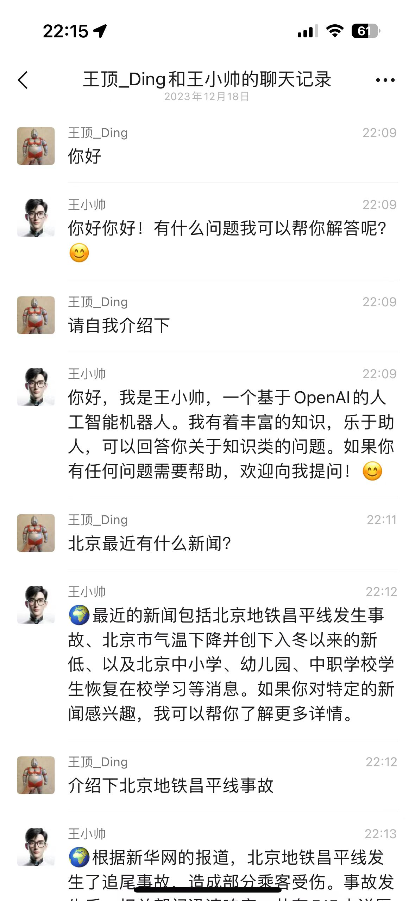

## 用户交流
[telegram频道 ](https://sum4all.one/telegram)

# 版本更新
- V0.0.2，20231218，支持OpenAI三方代理，在worker中配置APIBASE的变量为代理地址即可
- V0.0.1，20231218，开源代码，可直接在cloudflare的worker里部署上线

# 产品介绍
- OpenAI联网版，根据你的意图判断是否需要联网，请求头和体都跟OpenAI一致，key也可以直接用OpenAI的，通过function calling实现
- 支持OpenAI三方代理地址，在worker中配置APIBASE变量，值为代理地址，注意不需要加v1，如果配置三方代理地址，请也使用三方的key
- 把search2ai文件里的代码直接在cloudflare的worker里部署，用部署上线后的地址作为你接口调用时的api base地址，即可实现联网，格式如 XXX/v1/chat/completions
- 懒得部署的，可以直接用我已经部署的版本，请求OpenAI的地址换成新的api base https://online.sum4all.one/v1

# 后续迭代
- 支持流式输出
- 接口兼容非对话
- 支持更多搜索服务
- 支持更多大模型
