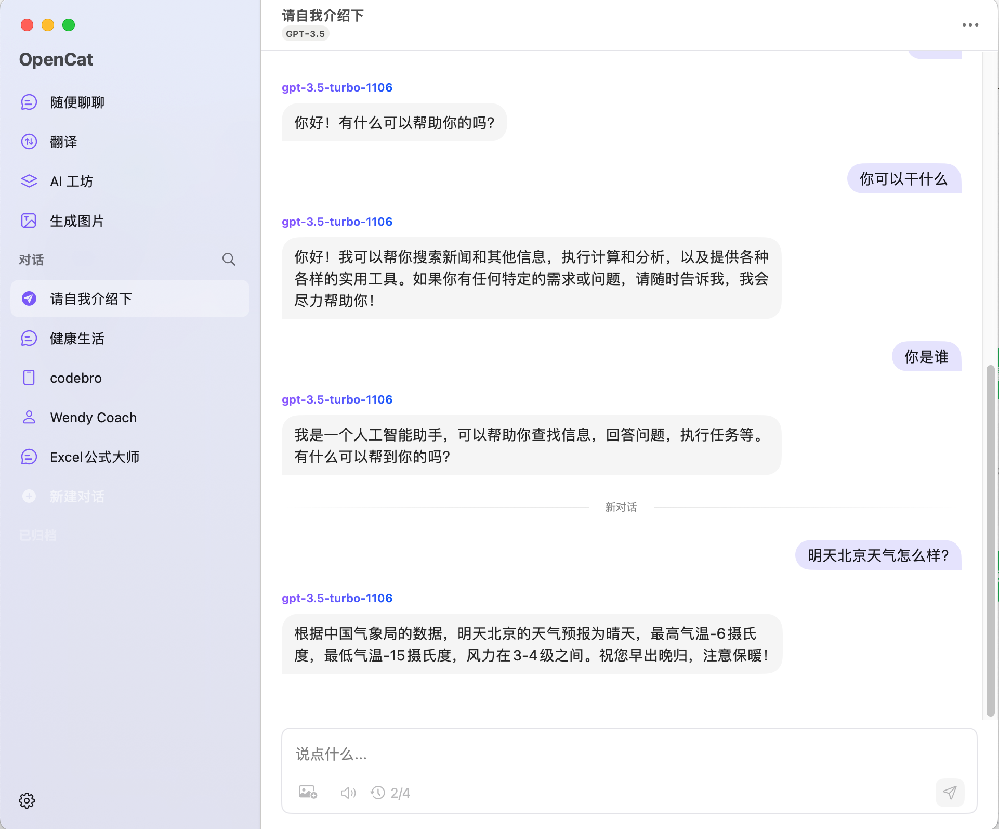

## 用户交流
[telegram频道 ](https://sum4all.one/telegram)

# 版本更新
- V0.0.4，20231220，支持Google、Bing搜索
- V0.0.3，20231220，支持流式输出，适配OpenAI三方客户端
- V0.0.2，20231218，支持OpenAI三方代理，在worker中配置APIBASE的变量为代理地址即可
- V0.0.1，20231218，开源代码，可直接在cloudflare的worker里部署上线

# 产品介绍
- search2ai，让你的 OpenAI 可以根据你的意图判断是否联网，不需要安装任何插件，也不需要更换key，直接在你常用的 OpenAI 三方客户端替换自定义域名为下面的地址即可，支持 Cloudflare 自行部署 

```
https://api.search2ai.online/v1
```




# 使用方法
- 直接使用：替换客户端自定义域名为上述地址即可
- 自行部署(有难度)
1. 复制[search2ai](https://search2ai.online/cloudflare)的代码，在cloudflare的worker里部署，上线后的worker的地址可作为你接口调用时的自定义域名地址，注意拼接，worker地址仅代表v1前的部分 XXX/v1/chat/completions
2. worker中配置变量
- APIBASE：如果你在用 OpenAI 三方代理，可在这里填入，注意不需要加v1，非必填
- SEARCH_SERVICE：暂时支持google、bing，必填
- BING_KEY：如选bing搜索必填，请自行搜索教程，申请地址 https://search2ai.online/bing
- GOOGLE_CX：如选Google搜索必填，Search engine ID，请自行搜索教程，申请地址 https://search2ai.online/googlecx
- GOOGLE_KEY：如选Google搜索必填，API key，申请地址 https://search2ai.online/googlekey


# 后续迭代
- 接口兼容非对话场景
- 支持更多搜索服务
- 支持更多大模型
- 支持browserless自建

# 特别鸣谢
- [webpilot](https://github.com/webpilot-ai/Webpilot)
- [LobeChat](https://github.com/lobehub/lobe-chat?tab=MIT-1-ov-file)