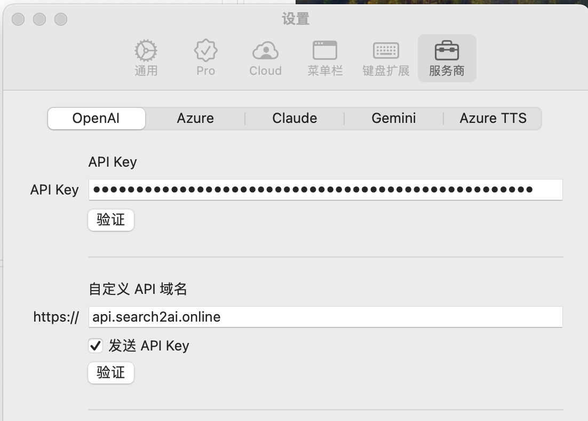

**简体中文** · [English](README-EN.md) 

## 用户交流
[telegram频道](https://sum4all.one/telegram)

## 友情赞助
<a href="https://www.buymeacoffee.com/fatwang2" target="_blank"></a>

# 版本更新
- V0.1.5，20240205，支持新闻搜索，快速浏览新闻更方便
- V0.1.4，20240120，支持Zeabur一键部署，非常方便，强烈推荐！
- V0.1.3，20240120，支持本地部署，可自行部署在自己的服务器上
- V0.1.2，20240115，修复cloudflare worker版本非搜索场景下的流式输出问题
- V0.1.1，20240114，支持vercel一键部署，目前只适合喜欢折腾的人

更多历史更新，请参见 [版本记录](https://github.com/fatwang2/search2ai/releases)

# 产品介绍
- search2ai，让你的 OpenAI API 支持联网，搜索、新闻、网页总结，大模型会根据你的输入判断是否联网，不是每次都联网搜索，不需要安装任何插件，也不需要更换key，直接在你常用的 OpenAI 三方客户端替换自定义地址即可，也支持自行部署，不会影响使用 OpenAI 的其他功能，如画图、语音等 

<table>
    <tr>
        <td></td>
        <td></td>
    </tr>
    <tr>
        <td></td>
        <td></td>
    </tr>
</table>

# 使用方法
**直接使用：替换客户端自定义域名为下面地址即可**
```
https://api.search2ai.online
```
如图所示
<table>
    <tr>
        <td></td>
        <td></td>
    </tr>
</table>

demo站体验地址：[demo站](https://search2ai.online/demo)，根据提示使用你的key，更换自定义域名即可

**Zeabur一键部署（强烈推荐）**

点击按钮即可一键部署，默认duckduckgo搜索，可自行修改环境变量进行切换

[](https://zeabur.com/templates/A4HGYF?referralCode=fatwang2)

如需保持项目更新，建议先fork本仓库，再通过Zeabur部署你的分支

[](https://zeabur.com?referralCode=fatwang2&utm_source=fatwang2&utm_campaign=oss)

环境变量
- SEARCH_SERVICE：暂时支持google、bing、serpapi、serper、duckduckgo（推荐），必填
- APIBASE：如果你在用 OpenAI 三方代理，可在这里填入，注意不需要加v1，非必填
- NEWS_KEY: 单独的新闻搜索服务，如需体验可加入 [telegram频道 ](https://sum4all.one/telegram)申请Key，暂时免费
- BING_KEY：如选bing搜索必填，请自行搜索教程，申请地址 https://search2ai.online/bing
- GOOGLE_CX：如选Google搜索必填，Search engine ID，请自行搜索教程，申请地址 https://search2ai.online/googlecx
- GOOGLE_KEY：如选Google搜索必填，API key，申请地址 https://search2ai.online/googlekey
- SERPAPI_KEY: 如选serpapi必填，免费100次/月，注册地址 https://search2ai.online/serpapi
- SERPER_KEY: 如选serper必填，6个月免费额度2500次，注意变量名称跟上面不一样，注册地址 https://search2ai.online/serper

**本地部署**
1. 克隆仓库到本地
```
git clone https://github.com/fatwang2/search2ai
```
2. 复制.env.template为.env，配置环境变量
- SEARCH_SERVICE：暂时支持google、bing、serpapi、serper、duckduckgo（推荐），必填
- APIBASE：如果你在用 OpenAI 三方代理，可在这里填入，注意不需要加v1，非必填
- NEWS_KEY: 单独的新闻搜索服务，如需体验可加入 [telegram频道 ](https://sum4all.one/telegram)申请Key，暂时免费
- BING_KEY：如选bing搜索必填，请自行搜索教程，申请地址 https://search2ai.online/bing
- GOOGLE_CX：如选Google搜索必填，Search engine ID，请自行搜索教程，申请地址 https://search2ai.online/googlecx
- GOOGLE_KEY：如选Google搜索必填，API key，申请地址 https://search2ai.online/googlekey
- SERPAPI_KEY: 如选serpapi必填，免费100次/月，注册地址 https://search2ai.online/serpapi
- SERPER_KEY: 如选serper必填，6个月免费额度2500次，注意变量名称跟上面不一样，注册地址 https://search2ai.online/serper

3. 进入api目录，运行程序，实时显示日志
```
cd api && nohup node index.js > output.log 2>&1 & tail -f output.log
```

4. 端口3014，拼接后的完整地址如下，可根据客户端的需求配置apibase地址使用（如需https，需用nginx进行反代，网上教程很多）
```
http://localhost:3014/v1/chat/completions
```

**cloudflare worker部署**
1. 复制[search2ai](https://search2ai.online/cloudflare)的代码，不需要任何修改！在cloudflare的worker里部署，上线后的worker的地址可作为你接口调用时的自定义域名地址，注意拼接，worker地址仅代表v1前的部分 XXX/v1/chat/completions

2. 在worker中配置变量

- SEARCH_SERVICE：暂时支持google、bing、serpapi、serper、duckduckgo（推荐），必填
- APIBASE：如果你在用 OpenAI 三方代理，可在这里填入，注意不需要加v1，非必填
- NEWS_KEY: 单独的新闻搜索服务，如需体验可加入 [telegram频道 ](https://sum4all.one/telegram)申请Key，暂时免费
- BING_KEY：如选bing搜索必填，请自行搜索教程，申请地址 https://search2ai.online/bing
- GOOGLE_CX：如选Google搜索必填，Search engine ID，请自行搜索教程，申请地址 https://search2ai.online/googlecx
- GOOGLE_KEY：如选Google搜索必填，API key，申请地址 https://search2ai.online/googlekey
- SERPAPI_KEY: 如选serpapi必填，免费100次/月，注册地址 https://search2ai.online/serpapi
- SERPER_KEY: 如选serper必填，6个月免费额度2500次，注意变量名称跟上面不一样，注册地址 https://search2ai.online/serper

3. worker里配置触发器-自定义域名，国内直接访问worker的地址可能会出问题，需要替换为自定义域名


**vercel部署**

特别说明：vercel项目暂不支持流式输出，且有10s响应限制，实际使用体验不佳，放出来主要是想等大神给我pull request

一键部署

[](https://vercel.com/new/clone?repository-url=https%3A%2F%2Fgithub.com%2Ffatwang2%2Fsearch2ai&env=SEARCH_SERVICE&envDescription=%E6%9A%82%E6%97%B6%E6%94%AF%E6%8C%81google%E3%80%81bing%E3%80%81serpapi%E3%80%81serper%E3%80%81duckduckgo%EF%BC%8C%E5%BF%85%E5%A1%AB)

为保证更新，也可以先fork本项目后自己在vercel上部署

# 后续迭代
- 支持Gemini
- 支持Azure OpenAI
- 修复Vercel项目流式输出问题
- 提升流式输出的速度
- 支持更多垂类搜索