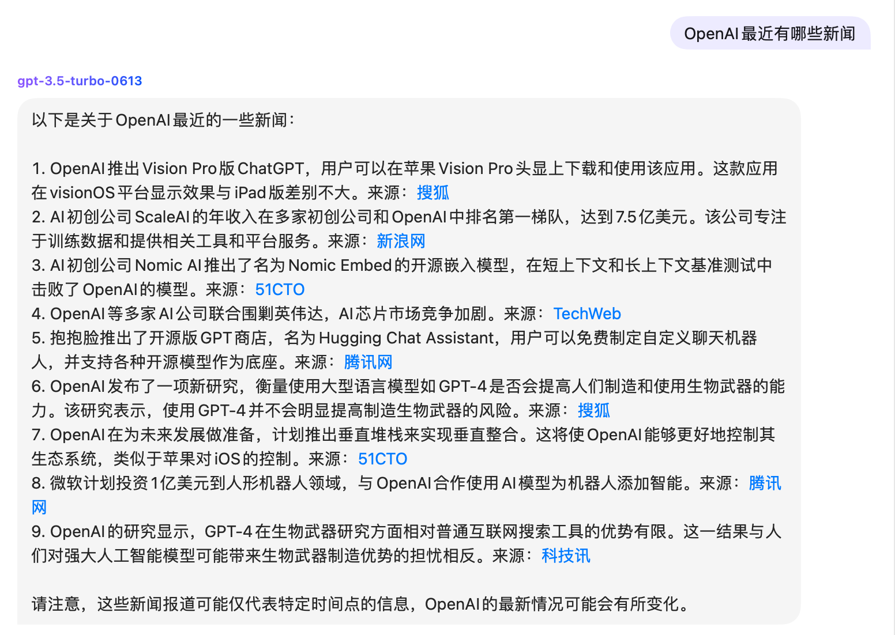
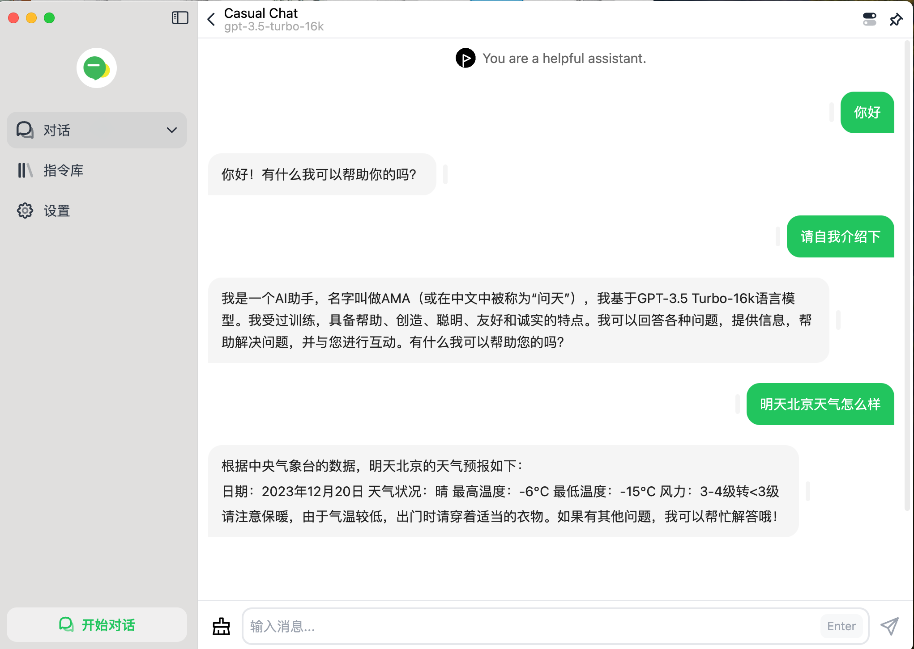
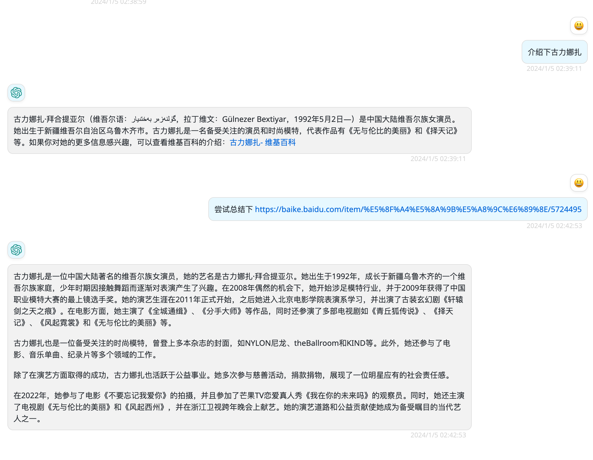
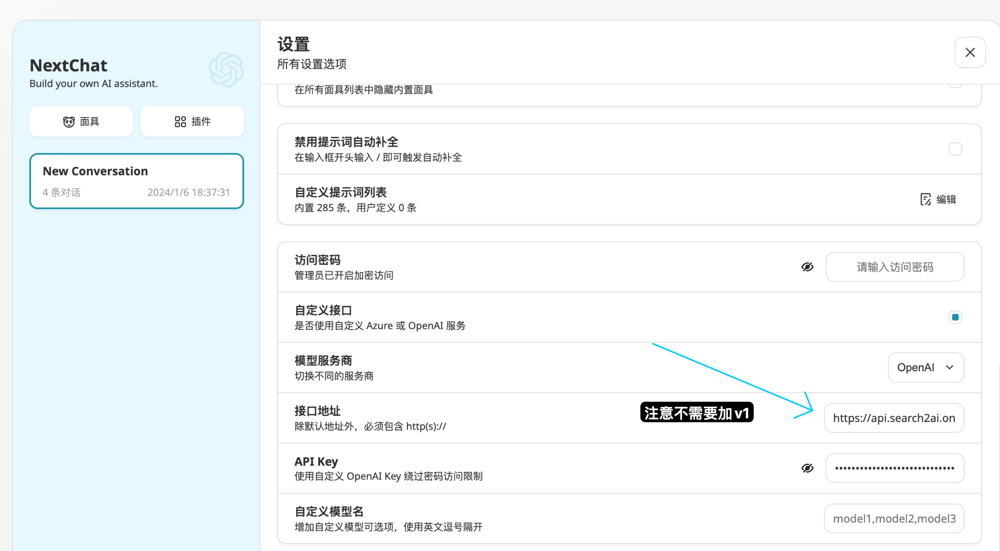
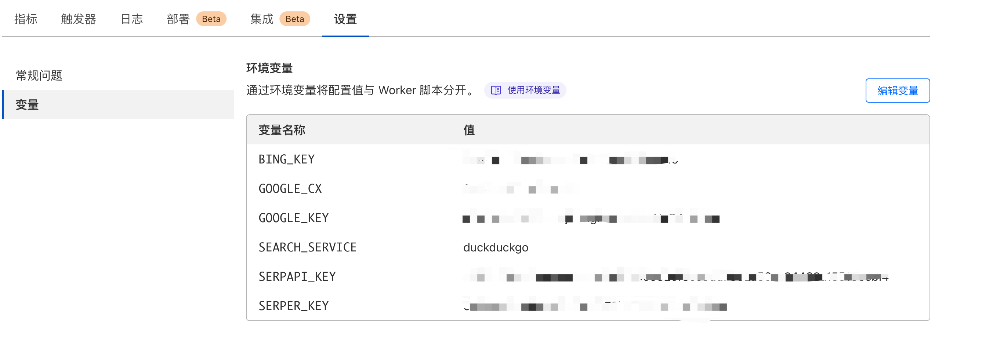
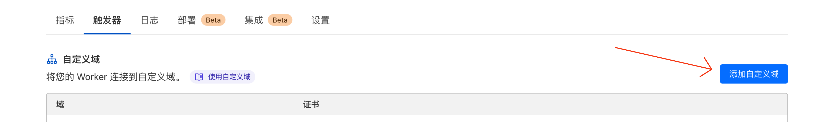

**简体中文** · [English](README-EN.md)

## 用户交流

[discord 频道](https://discord.gg/AKXYq32Bxc)

## 友情赞助

<a href="https://www.buymeacoffee.com/fatwang2" target="_blank"></a>

# 版本更新
- V0.2.6，20240425，支持 SearXNG 免费搜索服务，有损支持 Moonshot 流式模式
- V0.2.5，20240425，为了解决隐私担忧，开源搜索接口部分的代码
- V0.2.4，20240424，支持 Groq 的llama-3、mistral等模型，速度起飞
- V0.2.3，20240423，Cloudflare Worker版本支持Azure OpenAI；支持授权码，可自定义用户的请求key
- V0.2.2，20240420，支持 Moonshot 的非流式模式
- V0.2.1，20240310，支持Google、Bing、Duckduckgo、Search1API新闻类搜索；支持通过环境变量MAX_RESULTS调整搜索结果数量；支持通过环境变量CRAWL_RESULTS调整希望深度搜索的数量
- V0.2.0，20240310，优化openai.js，cloudflare worker版本，这次速度真的更快了！

更多历史更新，请参见 [版本记录](https://github.com/fatwang2/search2ai/releases)

# S2A

让你的 大模型 API 支持联网，搜索、新闻、网页总结，已支持OpenAI、Gemini、Moonshot(非流式)，大模型会根据你的输入判断是否联网，不是每次都联网搜索，不需要安装任何插件，也不需要更换key，直接在你常用的三方客户端替换自定义地址即可，也支持自行部署，不会影响使用的其他功能，如画图、语音等

<table>
    <tr>
        <td></td>
        <td></td>
    </tr>
    <tr>
        <td></td>
        <td></td>
    </tr>
</table>

# 功能

| 模型             | 功能                 | 流式输出     | 部署方式                                    |
| ---------------- | -------------------- | ------------ | ------------------------------------------- |
| `OpenAI`       | 联网、新闻、内容爬取 | 流式、非流式 | Zeabur、本地部署、Cloudflare Worker、Vercel |
| `Azure OpenAI` | 联网、新闻、内容爬取 | 流式、非流式 | Cloudflare Worker                           |
| `Groq`         | 联网、新闻、内容爬取 | 流式、非流式 | Cloudflare Worker                           |
| `Gemini`       | 联网                 | 流式、非流式 | Cloudflare Worker                           |
| `Moonshot`     | 联网、新闻、内容爬取 | 部分流式、非流式       | Zeabur、本地部署、Cloudflare Worker（流式）、Vercel |

# 使用

**替换客户端自定义域名为你部署后的地址**

<table>
    <tr>
        <td></td>
    </tr>
</table>

# 部署

**Zeabur一键部署**

点击按钮即可一键部署，修改环境变量

[](https://zeabur.com/templates/A4HGYF?referralCode=fatwang2)

如需保持项目更新，建议先fork本仓库，再通过Zeabur部署你的分支

[](https://zeabur.com?referralCode=fatwang2&utm_source=fatwang2&utm_campaign=oss)

**本地部署**

1. 克隆仓库到本地

```
git clone https://github.com/fatwang2/search2ai
```

2. 复制.env.template为.env，配置环境变量
3. 进入api目录，运行程序，实时显示日志

```
cd api && nohup node index.js > output.log 2>&1 & tail -f output.log
```

4. 端口3014，拼接后的完整地址如下，可根据客户端的需求配置apibase地址使用（如需https，需用nginx进行反代，网上教程很多）

```
http://localhost:3014/v1/chat/completions
```

**Cloudflare Worker部署**

1. 复制[search2openai.js](search2openai.js)或者[search2gemini.js](search2gemini.js)或者[search2groq.js](search2groq.js)的代码，不需要任何修改！在cloudflare的worker里部署，上线后的worker的地址可作为你接口调用时的自定义域名地址，注意拼接，worker地址仅代表v1前的部分
2. 在worker中配置环境变量
   
3. worker里配置触发器-自定义域名，国内直接访问worker的地址可能会出问题，需要替换为自定义域名
   

**Vercel部署**

特别说明：vercel项目暂不支持流式输出，且有10s响应限制，实际使用体验不佳，放出来主要是想等大神给我pull request

一键部署

[](https://vercel.com/new/clone?repository-url=https%3A%2F%2Fgithub.com%2Ffatwang2%2Fsearch2ai&env=SEARCH_SERVICE&envDescription=%E6%9A%82%E6%97%B6%E6%94%AF%E6%8C%81google%E3%80%81bing%E3%80%81serpapi%E3%80%81serper%E3%80%81duckduckgo%EF%BC%8C%E5%BF%85%E5%A1%AB)

为保证更新，也可以先fork本项目后自己在vercel上部署

# 环境变量

该项目提供了一些额外的配置项，通过环境变量设置：

| 环境变量             | 是否必须 | 描述                                                                                                                  | 例子                                                                             |
| -------------------- | -------- | --------------------------------------------------------------------------------------------------------------------- | -------------------------------------------------------------------------------- |
| `SEARCH_SERVICE`   | Yes      | 你的搜索服务，选择什么服务，就需要配置什么服务的key | `search1api, google, bing, serpapi, serper, duckduckgo, searxng`               |
| `APIBASE`          | No       | 三方代理地址                                                                                                         | `https://api.openai.com, https://api.moonshot.cn, https://api.groq.com/openai` |
| `MAX_RESULTS`      | Yes      | 搜索结果条数                                                                                                          | `10`                                                                           |
| `CRAWL_RESULTS`    | No       | 要进行深度搜索（搜索后获取网页正文）的数量，目前仅支持 search1api，深度速度会慢                                       | `1`                                                                            |
| `SEARCH1API_KEY`   | No       | 如选search1api必填，我自己的搜索服务，注册免费领取 100 积分，点击[链接](https://www.search1api.com/?utm_source=search2ai)                                 | `xxx`                                                                          |
| `BING_KEY`         | No       | 如选bing搜索必填，请自行搜索教程，点击[链接](https://www.microsoft.com/en-us/bing/apis/bing-web-search-api) 创建                                              | `xxx`                                                                          |
| `GOOGLE_CX`        | No       | 如选Google搜索必填，Search engine ID，请自行搜索教程，点击[链接](https://programmablesearchengine.google.com/controlpanel/create) 创建                      | `xxx`                                                                          |
| `GOOGLE_KEY`       | No       | 如选Google搜索必填，API key，点击[链接](https://console.cloud.google.com/apis/credentials) 创建                                              | `xxx`                                                                          |
| `SERPAPI_KEY`      | No       | 如选serpapi必填，免费100次/月，点击[链接](https://serpapi.com/) 注册                                              | `xxx`                                                                          |
| `SERPER_KEY`       | No       | 如选serper必填，6个月免费额度2500次，点击[链接](https://serper.dev/) 注册                                         | `xxx`                                                                          |
| `SEARXNG_BASE_URL` | No       | 如选searxng必填，填写自建searXNG服务域名，需打开 json 模式，教程参考[链接](https://github.com/searxng/searxng) | `https://search.xxx.xxx`                                                                         |
| `OPENAI_TYPE`      | No       | openai供给来源，默认为openai                                                                                          | `openai, azure`                                                                |
| `RESOURCE_NAME`    | No       | 如选azure必填                                                                                                         | `xxxx`                                                                         |
| `DEPLOY_NAME`      | No       | 如选azure必填                                                                                                         | `gpt-35-turbo`                                                                 |
| `API_VERSION`      | No       | 如选azure必填                                                                                                         | `2024-02-15-preview`                                                           |
| `AZURE_API_KEY`    | No       | 如选azure必填                                                                                                         | `xxxx`                                                                         |
| `AUTH_KEYS`        | No       | 如果希望用户请求的时候单独定义授权码作为key，则需要填写，如选azure则必填                                              | `000,1111,2222`                                                                |
| `OPENAI_API_KEY`   | No       | 如果希望用户请求openai的时候也单独定义授权码作为key，则需要填写                                                       | `sk-xxx`                                                                       |

# 后续迭代

- 修复Vercel项目流式输出问题
- 提升流式输出的速度
- 支持更多垂类搜索
